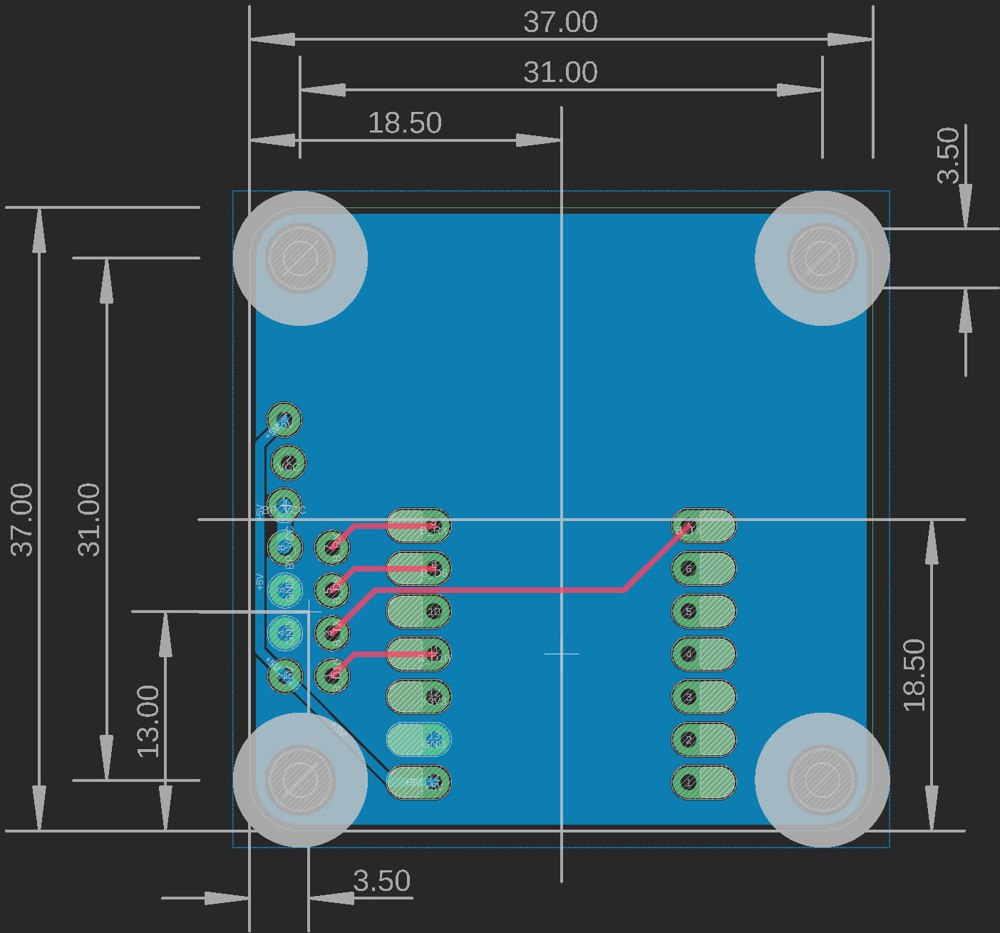
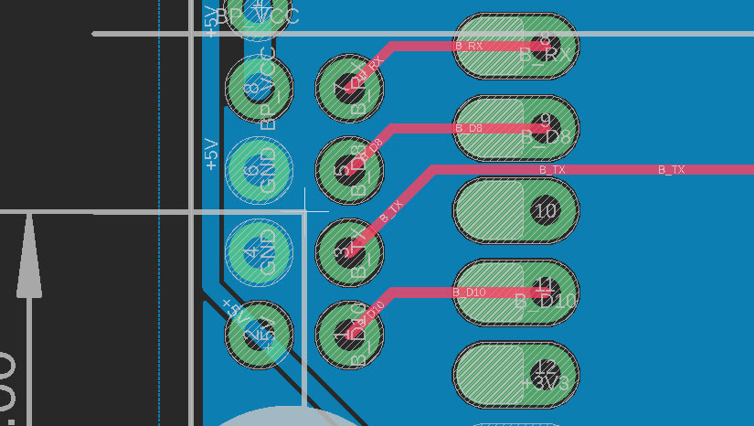
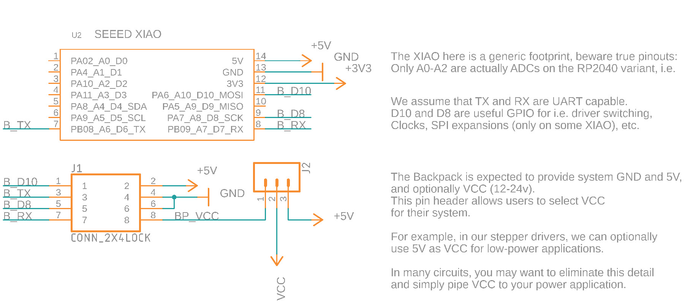

## The PHY Backpack

... we want this because modular systems want various types of PHY, but we wanted to be able to use lots of modules in lots of different systems. 

*TODO: a diagram of circuits (left) with various backpacks (right), mixing* 

Since the PHYs and link layers are useful modules on their own, we're maintaining this as a pseudo circuit-specification.

- [design files (eagle, sorry Q)](compatible-template/design/)
- [gerbers](compatible-template/gerbers/)

### Pinout 

| | |
| --- | --- |
| 5V | RX |
| GND | D8 |
| GND | TX |
| VCC | D10 |

We expect many but not all PHYs will deliver VCC (12-24v). 

### Physical Spec

Boards should have 4x 3.5mm through holes spaced in a 31mm sided square. Board outlines are 37mm to a side, with a 3mm radius fillet at each corner. Hole centers end up 3mm from the board edge.

The bus header is 2x4 0.1" thru-hole. Its center is 13mm up and 3.5mm right of the bottom left corner of the board. 

There is additionally a 1x3 0.1" header for VCC select. Which can be used to change your board's power selection from 5V (over USB) or bus-provided VCC. You can delete this if you'd like to fix a selection, or replace it with something like a solder jumper etc. 

Backpacks should provide a dual-5v-source protection diode, to prevent i.e. 5V (from the bus) competing with 5V (from the XIAO). 

 