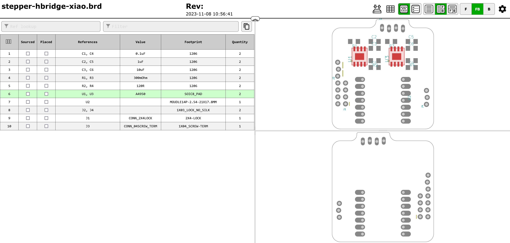

## Notes on Automating Circuit Rendering and Docs

I've described a folder specification in [the README here](README.md), but when generating these circuits, it's a bit of a burden to make all of the renders (schematic, front/back, and BOM info). These data are super valuable to circuit-users, though, so a TODO / WIP is to automate their generation from design source files. 

Both of the methods below could be integrated using a folder-scraping tool, maybe with a little YAML frontmatter for each circuit, to mark i.e. version info (compatibilities with newer modular-things systems), authors, etc etc... 

Probably the main PITA is that none of these soln's have a good way to process a `schematic.jpg` - 

### Automating Front and Back SVGs with TraceSpace 

Using the [tracespace](https://github.com/tracespace/tracespace/tree/v5) [core example](https://github.com/tracespace/tracespace/tree/v5/packages/core) [installed at V5](https://www.npmjs.com/package/@tracespace/core/v/next) it's pretty easy to extract a nice SVG render using i.e. this example script:

```js
import fs from 'node:fs/promises'
import { read, plot, renderLayers, renderBoard, stringifySvg } from '@tracespace/core'

const dir = '../stepper-hbridge-xiao/gerbers'

const files = [
  `${dir}/GerberFiles/copper_top.gbr`,
  `${dir}/GerberFiles/soldermask_top.gbr`,// 'top-solder-mask.gbr',
  `${dir}/GerberFiles/silkscreen_top.gbr`,// 'top-silk-screen.gbr',
  `${dir}/GerberFiles/copper_bottom.gbr`,// 'bottom-copper.gbr',
  `${dir}/GerberFiles/soldermask_bottom.gbr`,// 'bottom-solder-mask.gbr',
  `${dir}/GerberFiles/silkscreen_bottom.gbr`,// 'outline.gbr',
  `${dir}/GerberFiles/profile.gbr`,// 'drill.xnc',
  `${dir}/DrillFiles/drill_1_16.xln`
]

const readResult = await read(files)
const plotResult = plot(readResult)
const renderLayersResult = renderLayers(plotResult)
const renderBoardResult = renderBoard(renderLayersResult)

await Promise.all([
  fs.writeFile('top.svg', stringifySvg(renderBoardResult.top)),
  fs.writeFile('bottom.svg', stringifySvg(renderBoardResult.bottom))
])
```

| Top Example | Bottom Example |
| --- | --- |
|  |  |

### Automating BOM HTML with InteractiveHTMLBOM

This [InteractiveHTMLBOM tool](https://github.com/openscopeproject/InteractiveHtmlBom) is rad, and spits out simple, self-contained HTML files that lets circuit-assemblers look at parts on a board and highlight which-part-goes-where, according to design files.



That's simple enough to run, see [their docs here](https://github.com/openscopeproject/InteractiveHtmlBom/wiki/Usage) - note that it is a *KiCAD* native plugin, but works also [for eagle / fusion / .brd](https://github.com/openscopeproject/InteractiveHtmlBom/wiki/Usage#note-for-eaglefusion360-users) files. 