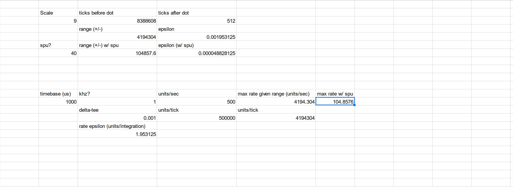

## 2022 12 14 

OK today I'm trying to whip the integrator up to use fixed point maths... and bring the integrator rate way up, I think as a baseline the current integrator runs in ~ 100us, or something? I run the integrator on a 250us period, so hopefully we can crank that to a ~ 50us integrator period, with 5us integration step or less. 

I think I have the basics here, 

```cpp
// where's the radix... picking 16 (the middle) ~ arbitrarily 
// so we have 2^16 = 65 536 dots after the pt, (0.000015...)
// and 2^16 = 65 536 dots in front of the pt, so we have max vals (accel, pos, etc) +/- 32.5k, not bad, 
const int32_t fp_scale = 16;

// get explicit abt which are fixed point ints, 
typedef int32_t fpint32_t;

// and ops w/ em 
float fp_fixedToFloat(fpint32_t fixed);
fpint32_t fp_floatToFixed(float flt);
int32_t fp_fixedToInt(fpint32_t fixed);
fpint32_t fp_intToFixed(int32_t inty);

// addition & subtraction is just integer addition, straight up 
// but w/ multiplication we need a little scaling, so: 
fpint32_t fp_mult(fpint32_t a, fpint32_t b);
fpint32_t fp_div(fpint32_t num, fpint32_t denum);
```

```cpp
// hmmm https://www.youtube.com/watch?v=S12qx1DwjVk& at ~ 18:00 
float fp_fixedToFloat(fpint32_t fixed){
  return ((float)fixed / (float)(1 << fp_scale));
}

// actually this is unclear to me... https://www.youtube.com/watch?v=S12qx1DwjVk& at 16:57
fpint32_t fp_floatToFixed(float flt){
  return (flt * (float)(1 << fp_scale));
}

int32_t fp_fixedToInt(fpint32_t fixed){
  return (fixed >> fp_scale);
}

fpint32_t fp_intToFixed(int32_t inty){
  return (inty << fp_scale); 
}

// w/ fixed point mult, we have some out-of-ranging trouble, 
// we can maybe do this w/ 64-bit ints, but it's going to suck a little bit of time
// though still better than the floating point libs, 
fp_int32_t fp_mult(fpint32_t a, fpint32_t b){
  return ((int64_t)(a) * (int64_t)(b)) >> fp_scale;
}
// we can instead do it w/ some fancy shifting, but I'm not going to get into this yet: 
// leaving it as a potential speedup... 
// https://www.youtube.com/watch?v=npQF28g6s_k& 7:40 
// fp_int32_t fp_mult(fpint32_t a, fpint32_t b){
//   return ((a >> 6) * (b >> 6)) >> 4;
// }

// division...
fpint32_t fp_div(fpint32_t num, fpint32_t denum){
  return ((int64_t)(num) << fp_scale) / denum;
}
```

So I can more or less dead-nuts replace the current integrator with these maths, then see if I can get similar results as what I had previously. 

## 2022 12 15 

Alrigh I've this loaded and running and, yeah, integrator runs now around 4us relative the previous ~ 50... looks like I would be OK running the integrator up to 10KHz, maybe 20? But does it still work... Hmm - more like 4us when everything is inactive, 10-20us when it's chugging along actually doing maths. 

I think the crux of the manner in which this is currently set up is that there's a big dynamic range between the ~ position, velocity values, and the delta-T, which is very small (0.0001 here, w/ 100us time). 

Better would be to store speeds, etc, in delta-T base time? But we then also invite a suspiciously large amount of converting-in-and-out fkery. 

I think I'm going to carry on w/ this, then think about adding precision later on... first, will try to add the dead-reckoning integration steps. 

OK, it's ~ happening, as is the dead reckoning bit of the integrator, but I'm having scaling troubles... on position, especially, and also the stop distance maths is not working: maybe that's also scaling things out of range? 

I should print stopDistance and positionDelta out of the state endpoint, perhaps, to debug a little better? Then I can come up with a better scaling... solution, something ? Maybe I should just set my integrator up so that the integration step... or the delT is some power of 2? 

Yep - I think I am scaling outside of my ranges, while doing this line:

```cpp
// for vf = 0, d = (vel^2) / (2 * a)
stopDistance = fp_div(fp_mult(vel, vel), fp_mult(fp_intToFixed(2), maxAccel));
```

Since ~ vals here are 200 (for vel, with steps-rep at motor being ~ 4k), so * 2 = 16 million, easily out of range. We need a better way to calculate stopping distnace... or a better way to span these dynamic ranges. 

Certainly one approach would be to do all of this maths up front, send some simpler representation downstream... 

OK, I unfk-d this by elevating the whole calc into doubles:

```cpp
// big-div, 
fpint32_t fp_calcStopDistance(fpint32_t _vel, fpint32_t _maxAccel){
  int64_t _velSq = ((int64_t)(_vel) * (int64_t)(_vel)) >> fp_scale;
  int64_t _accelTwo = ((int64_t)(_maxAccel) * (int64_t)(fp_intToFixed(2))) >> fp_scale;
  return (_velSq << fp_scale) / _accelTwo;
}
```

That's the basics, then, but I think I need some position scalar... we can perhaps have this-scale velocity, etc, but can't do it with position - for sure. 

### Time Bases

I think the trouble here is in ranges w/r/t time bases: if we have our fixed point after 16 bits, we have 65k ticks on either side: so max. range of a position value, i.e., is 32k on either end. Taken with SPU in the way, that's ~ 800, or 400mm (around). Not enough. However, it is (barely) enough precision to do speeds w/r/t *one second* - units / sec, etc: where our **delta-tee** is ~ `0.0001` (for a 10khz clock), so, only ~ kind of inside of our epsilon of `0.000015` 

The trouble is that speeds need (relatively) high precision, but are hampered by this tiny delta-tee multiplication where i.e. `velocity = accel * delT` or `pos = vel * delT` at each step. Positions, in the same precision, need more *range* 

If we move the time base around, we can *move decimal places relative in speed* while **expanding those in position** - which is not time-based. 

Eh - actually, after looking at this... the middle ground uses `units/ms` as a timebase, and use fixed point w/ 8 bits (or 9...) (!) of resolution after the dot.



These are ~ fine as is, maybe, but does a little better with a 10ms timebase, a little awkward, but here we are: same position resolutions, then with 1000mm/sec max rate (with SPU applied, etc). 

I think a more sane approach would be to just roll position around somehow... it seems ~ somewhat inevitable... that amounts to not changing the existing code too much, save for the wrapping-integer, and for looking a little differently at target positions. 

---

## Perf Goals

- from 50us integration step, 250us integration period 
  - to 5us step, 50us period 
- better than this 0.000092 "delT" (where reality is 0.0001) - that's 8 % error on everything, bad ! - could swap to milliseconds timebase for velocities, etc? 
  - absolute bounds 
- reporting on abs-max accels, vels, based on delT *and* fixed point range?